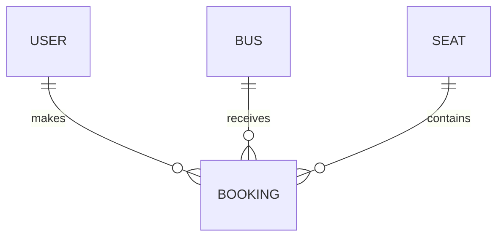
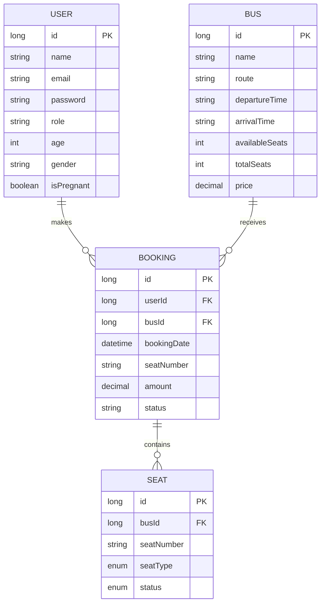
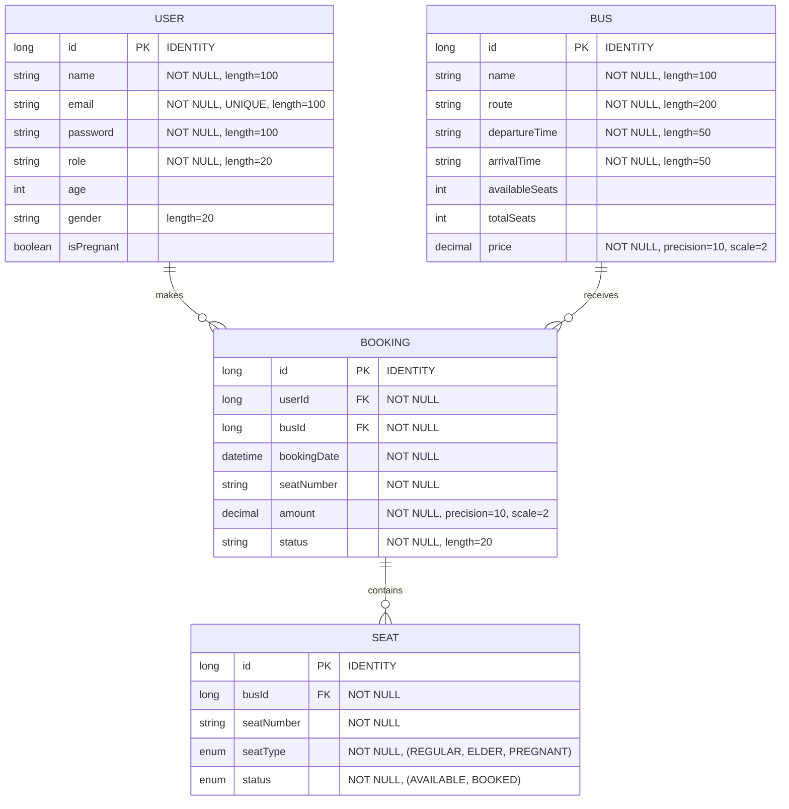

# Bus Booking System - ER Diagrams

## Level 0 (Context Level) ER Diagram

## Level 1 (Conceptual Level) ER Diagram

## Level 2 (Logical Level) ER Diagram

## Entity Descriptions

### User Entity
- Represents users of the system (both passengers and administrators)
- Contains personal information and authentication details
- Has a role field to distinguish between different user types
- Includes special status fields (age, gender, pregnancy) for seat allocation

### Bus Entity
- Represents the bus vehicles in the system
- Contains route information and timing details
- Tracks seat availability and pricing
- Has a unique identifier and descriptive information

### Booking Entity
- Represents a booking made by a user
- Links users, buses, and seats together
- Contains booking details like date, amount, and status
- Tracks the specific seat booked

### Seat Entity
- Represents individual seats on a bus
- Has different types (Regular, Elder, Pregnant)
- Tracks availability status
- Associated with a specific bus

## Relationships
1. User to Booking: One-to-Many
   - A user can make multiple bookings
   - Each booking belongs to one user

2. Bus to Booking: One-to-Many
   - A bus can have multiple bookings
   - Each booking is associated with one bus

3. Booking to Seat: One-to-Many
   - A booking can contain multiple seats
   - Each seat can be part of one booking

4. Bus to Seat: One-to-Many
   - A bus has multiple seats
   - Each seat belongs to one bus 